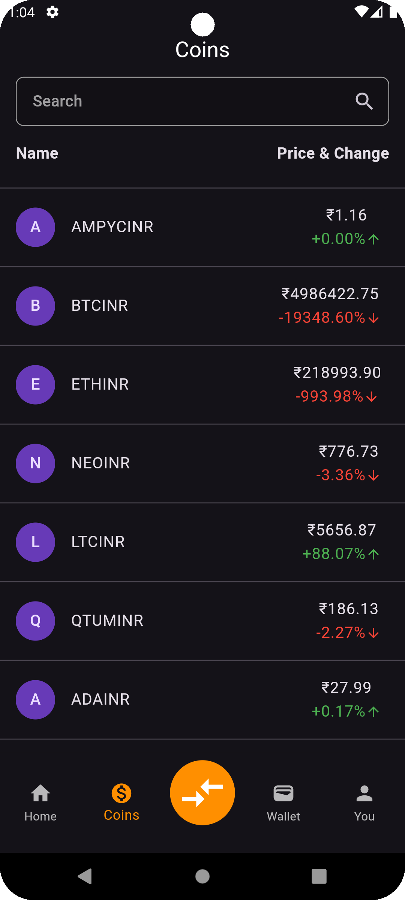
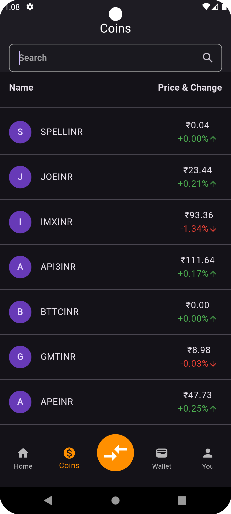
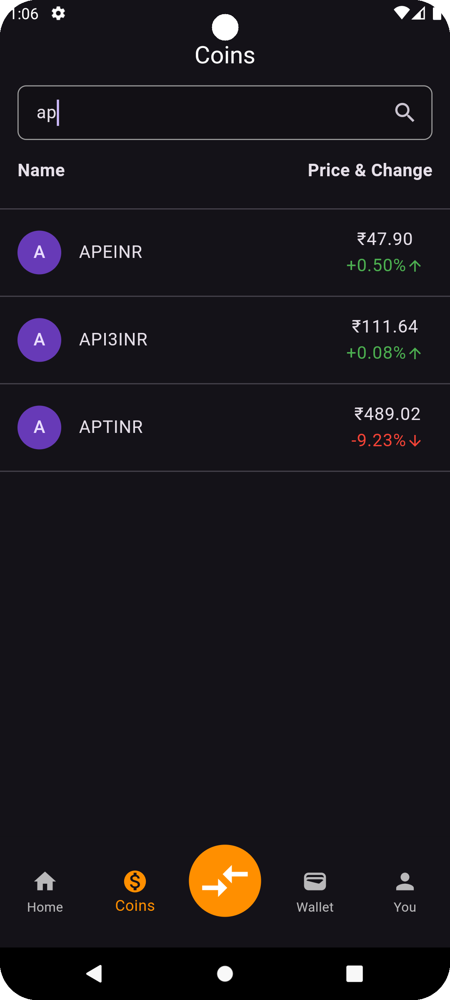

# Crypto Coin App

Welcome to the **Crypto Coin App**! This project is a submission for the **FLUTTER INTERNSHIP INTERVIEW TASK** at **AI Bharata Emerging Technologies Pvt Ltd**. The task involves creating a better UI for the Ampiy app's Home Page and displaying live cryptocurrency data via a WebSocket connection.

## Table of Contents

* [Introduction](#introduction)
* [Features](#features)
* [Screenshots](#screenshots)
* [Video Demonstration](#video-demonstration)
* [Getting Started](#getting-started)
* [WebSocket API Integration](#websocket-api-integration)
* [Technologies Used](#technologies-used)
* [Acknowledgements](#acknowledgements)

## Introduction

This app implements a redesigned home page for the Ampiy app, providing a more visually appealing interface. It connects to Ampiy's WebSocket API to display real-time cryptocurrency data, including the current price and percentage change for various coins.

## Features

- **Enhanced UI/UX**: A modern and clean user interface designed to improve user experience.
- **Real-time Data**: Fetches live cryptocurrency data using WebSocket technology.
- **Coin List**: Displays a list of cryptocurrencies with their current price and percentage change.
- **Search Functionality**: Allows users to search for specific cryptocurrencies by symbol.
- **Color Coding**: Percentage changes are color-coded with green for positive changes and red for negative changes to easily identify market trends.


## Screenshots

### Coin List

    

<br/><br/>

### Search



## Video Demonstration

Watch a video demonstration of the project below:


## Getting Started

To get a local copy up and running, follow these steps:

### Prerequisites

* Flutter SDK
* Android Studio or any other IDE supporting Flutter
* Git

### Installation

1. **Clone the repo**

   ```bash
   git clone [https://github.com/aarsh-hadap19/crypto-coin.git](https://github.com/aarsh-hadap19/crypto-coin.git)

2. Navigate to the project directory
   ```bash
   cd crypto-coin
3. Install dependencies
  ```Bash
  flutter pub get
  ```
## WebSocket API Integration

The app connects to the WebSocket API provided by Ampiy to fetch real-time data. The connection setup involves:

* **Connecting to WebSocket:**
    * WebSocket URL: ws://prereg.ex.api.ampiy.com/prices [invalid URL removed]
* **Subscribing to Ticker Stream:**
    * Send the following JSON message upon connection:
    ```json
    {
      "method": "SUBSCRIBE",
      "params": [
        "all@ticker"
      ],
      "cid": 1
    }
    ```
## Receiving Data

The app listens to the stream and updates the UI with the current price and percentage change for each cryptocurrency. 

The received data is in the following format:

```json
{
  "stream": "all@fpTckr",
  "data": [
    {
      "T": "fpTckr",
      "s": "BTCINR",
      "p": "-1351.78000000",
      "P": "-2.740",
      "c": "3615589.2020",
      "o": "3717432.3072",
      "h": "3744326.4270",
      "l": "3595768.0014",
      "b": "3615139.4222",
      "a": "3615372.2228"
    },
    {
      "T": "Ticker",
      "s": "ETHINR",
      "p": "-188.41000000",
      "P": "-4.488",
      "c": "302113.4000",
      "o": "316308.2094",
      "h": "320058.6346",
      "l": "300351.9508",
      "b": "302074.9766",
      "a": "302113.4000"
    }
  ]
}
```
## Technologies Used

- **Flutter**: UI framework for building natively compiled applications for mobile, web, and desktop from a single codebase.
- **Dart**: Programming language optimized for building user interfaces with a focus on concurrency and speed.
- **WebSocket**: A protocol providing full-duplex communication channels over a single TCP connection for real-time data streaming.

## Acknowledgements

- **Ampiy App**: Inspiration for the UI redesign and WebSocket data integration.
- **AI Bharata Emerging Technologies Pvt Ltd**: For providing the task and the opportunity to work on this project.


